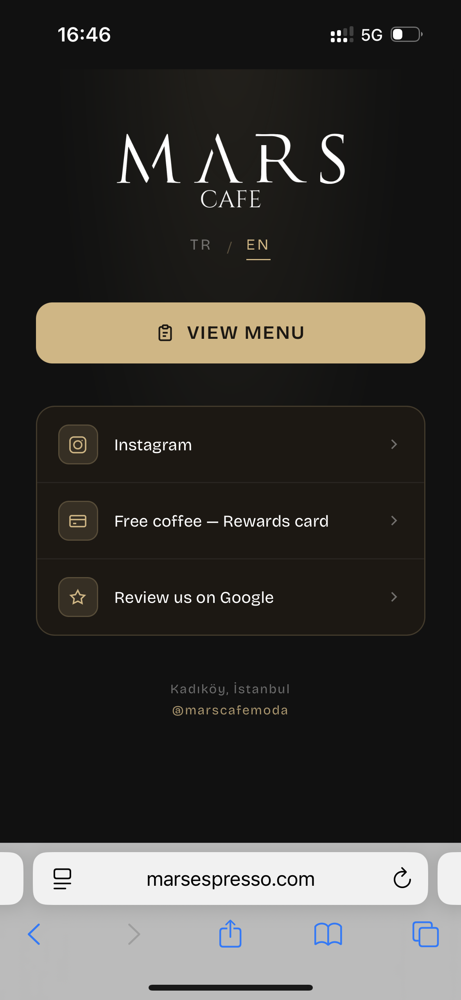

# Mars Cafe — Landing

A simple single-page landing (plain HTML/CSS/JS, no build step) for Mars Cafe in Kadıköy. Opened via a QR code on tables: links to the menu, loyalty card, Instagram, and Google review.

## Features

- Button to the menu (`menu.marsespresso.com`)
- Link to the loyalty card (`card.marsespresso.com`)
- Links to Instagram and Google review
- TR / EN language toggle (defaults based on `navigator.language`)

## Running

Just open `index.html` in a browser — no dependencies or build step needed.
